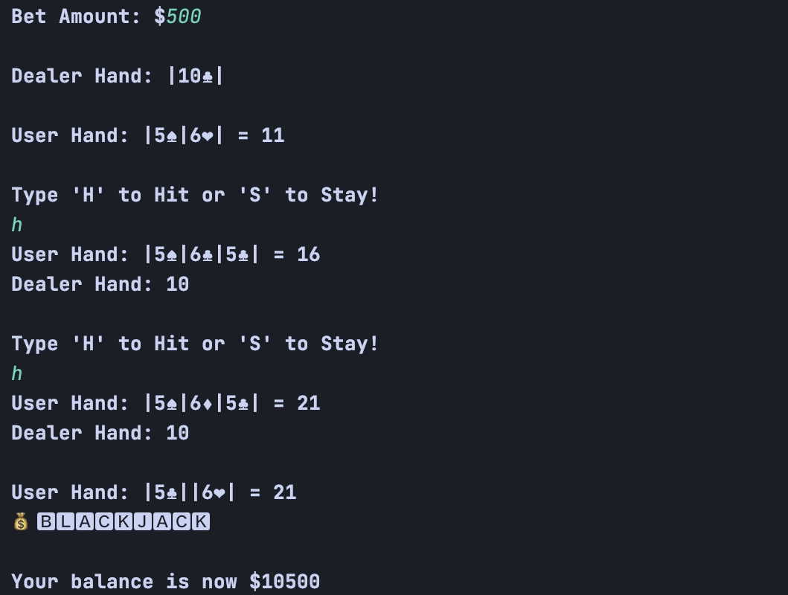

# **_`The Habibi Casino`_**
# Video Demo: https://youtu.be/zpsW_1FBBW8

    A fully interactive Casino program that simulates 
some of the most notorious Casino games.
The user is greeted with a command-line interface with game options for all four casino games. Users can select the game they wish to play via command-line arguments of 1,2,3, and 4. Once the user is done playing a game, they are granted the option to either cashout or continue playing. If the user cashes out, they are brought back to the command-line interface and are welcome to play other games after making another deposit. If a user has questions about a game, they are able to view the rules during gameplay by typing 'R'. 

   First we have a Top Dollar Slot Machine, a prize-based slot game that utilizes 3 rows and a prize range if the user strikes a crown in the center slot. Players can win by hitting standard jackpots as well.
The rules are as follows:
                  "Each spin grants a chance to land the Top Dollar wheel."
                  "If you land a crown symbol : 👑 in the middle column of the middle row,"
                  "the Top Dollar wheel is executed; allowing you to win a prize after 3 spins."
                  "NOTE: You will have 3 chances to spin the Top Dollar wheel when executed and"
                  "you get to decide which prize you wish to keep via the spin again/take prize options,"
                  "but beware that once you spin the Top Dollar wheel again, you are no longer eligible for the"
                  "preceding prize. NOTE: 👑 MUST LAND IN MIDDLE COLUMN TO GRANT TOP DOLLAR BONUS."
                  "This is Top Dollar Slots, crack a spin!"

Roulette, featuring both European and American tables. User's get a chance to win big with bets ranging from numbers to colors like the game we all know and love. This game utilizes traditional Roulette rules and the tables are structured like the real deal. 

Blackjack, the infamous money shredding game comes into play with a lightning fast dealer ready to take everything but your shirt from you. User's are dealt a hand of two cards with suits displayed and the dealer's card is dealt simultaneously. Will you hit or stay?
Last of all, I included a simple dice-rolling game for those who like to manage risk and still gain the fast-paced betting experience. Simply place your bet and start rolling. If you land a higher number than the house bot, you win! 

THIS IS... HABIBI CASINO! 

Can you beat the house? 

